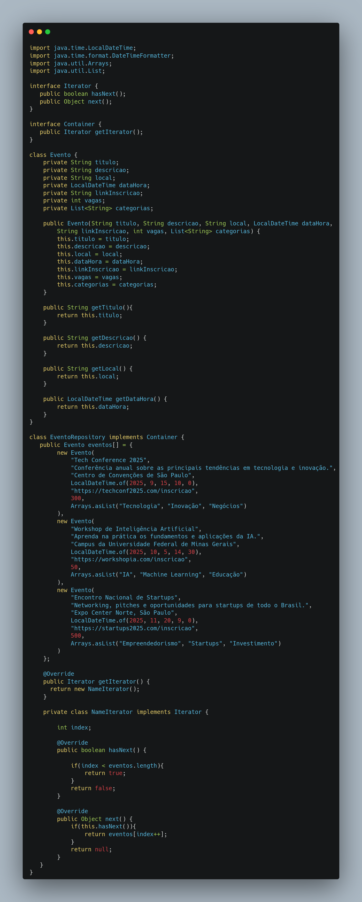
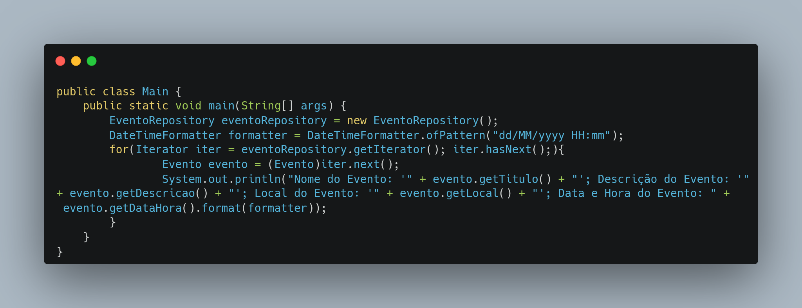
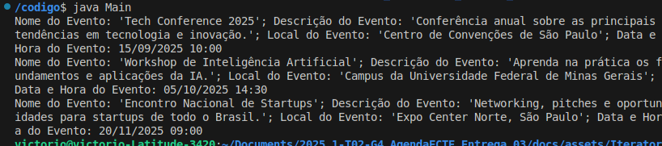

# Iterator

## Introdução

O Iterator é um padrão de projeto comportamental que tem como objetivo fornecer uma maneira de acessar os elementos de um objeto agregado sequencialmente sem expor sua representação subjacente. Em outras palavras, ele permite que você percorra uma coleção de elementos, como uma lista, array ou outra estrutura de dados, sem precisar saber como essa coleção está internamente organizada.

## Vantagens 

- **Encapsulamento da Iteração**: O Iterator oculta os detalhes de como uma coleção é percorrida. Você não precisa mais se preocupar se a coleção é um ArrayList, um HashTable ou qualquer outra estrutura de dados interna.
- **Polimorfismo na Iteração** : Permite que você use um único tipo de laço (loop) para percorrer qualquer coleção que implemente a interface Iterator. Isso significa que o seu código de iteração se torna genérico e reutilizável.
- **Desacoplamento de Classes**: Antes, seu código de iteração estaria diretamente ligado a classes concretas de coleção (como ArrayList). Com o Iterator, seu código depende apenas da interface Iterator, o que reduz o acoplamento.
- **Programação para Interfaces** : Reforça o princípio de "programar para interfaces, não para implementações". Ao depender da interface Iterator, seu sistema se torna mais flexível e fácil de estender ou modificar sem afetar o código cliente que usa a iteração.

## Código Iterator

A implementação do Iterator em código Java está disponível nas imagens abaixo

<center>

<a id="fig2">**Figura 1 – Implementação das interfaces Iterator e Container com as classes EventoRepository e Evento em Java**</a>



<font size="2"><p style="text-align: center"><b>_Autor: <a href="https://github.com/Victor-oss">Victório Lázaro</a>_</b></p></font>

<a id="fig2">**Figura 2 – Código Executável do Iterator em Java**</a>



<font size="2"><p style="text-align: center"><b>Autor: <a href="https://github.com/Victor-oss">Victório Lázaro</a> </b></p></font>

<a id="fig2">**Figura 3 – Print do Terminal Depois da Execução do Código**</a>



<font size="2"><p style="text-align: center"><b>Autor: <a href="https://github.com/Victor-oss">Victório Lázaro</a> </b></p></font>
</center>


## Como rodar

Esse código implementa o padrão de projeto Iterator para permitir a navegação sequencial por uma coleção de objetos Evento sem expor sua estrutura interna. A classe EventoRepository armazena um conjunto fixo de eventos e implementa a interface Container, fornecendo um método getIterator() que retorna uma instância da classe interna NameIterator. Essa classe interna implementa a interface Iterator, permitindo percorrer os eventos com os métodos hasNext() e next().
Na classe Main, o iterador é utilizado para imprimir os detalhes de cada evento, demonstrando como o padrão Iterator encapsula a lógica de iteração, mantendo o código cliente desacoplado da estrutura interna da coleção. Para rodar, basta dar os comandos abaixo na raiz do projeto

```
cd docs/assets/Iterator/codigo
javac Main.java
java Main
```
## Bibliografia

> DEVMEDIA. Padrão de Projeto Iterator em Java - Conceitos, Funcionamento e Aplicação prática. Disponível em: https://www.devmedia.com.br/padrao-de-projeto-iterator-em-java-conceitos-funcionamento-e-aplicacao-pratica/28748. Acesso em: 30 maio 2025.
>
> TUTORIALSPOINT. Design Patterns - Iterator Pattern. Disponível em: https://www.tutorialspoint.com/design_pattern/iterator_pattern.htm. Acesso em: 30 maio 2025.
>

## Histórico de Versões

| Versão | Data       | Descrição                                                      | Autor                                            | Revisor | Comentário do Revisor |
| ------ | ---------- | -------------------------------------------------------------- | ------------------------------------------------ | ------- | --------------------- |
| `1.1`  | 29/05/2025 | Adição do código executável do Iterator | [Victório Lázaro](https://github.com/Victor-oss) |         | 
| `1.2`  | 30/05/2025 | Adição da introdução e vantagens do Iterator, e bibliografia | [Alexandre Junior](https://github.com/AlexandreLJr) |         | 