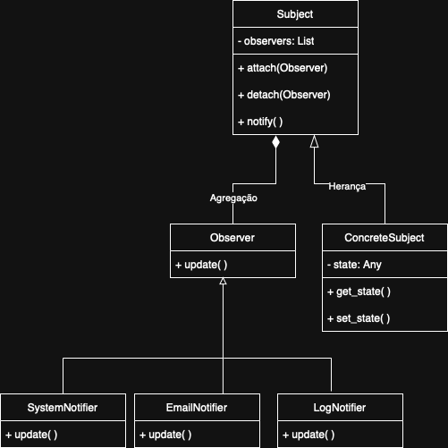
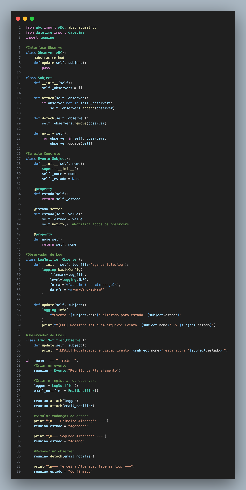
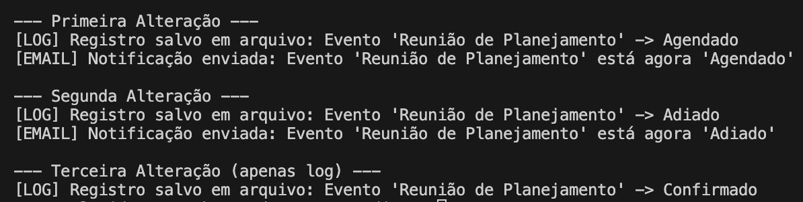

# Observer
O padrão de projeto Observer, pertencente ao grupo dos padrões comportamentais, tem como objetivo definir uma dependência de um-para-muitos entre objetos, de forma que quando um objeto muda de estado, todos os seus dependentes sejam notificados e atualizados automaticamente. Esse padrão é muito utilizado em situações onde diversos objetos precisam reagir a mudanças em um objeto central, sem que haja um forte acoplamento entre eles.

Na prática, o padrão Observer funciona com dois papéis principais: o Sujeito (Subject), que mantém uma lista de observadores e notifica-os sobre qualquer alteração no seu estado, e os Observadores (Observers), que recebem essas atualizações e reagem conforme sua lógica. Em Python, a implementação é feita criando métodos para adicionar, remover e notificar observadores, proporcionando uma comunicação eficiente e dinâmica entre os objetos.

## Aplicação no Projeto
O padrão Observer será aplicado no sistema AgendaFCTE para gerenciar notificações em tempo real sobre alterações em eventos. Quando um evento for criado, modificado ou cancelado, todos os usuários inscritos serão automaticamente notificados através de:

1. Notificações no sistema: Mensagens internas na plataforma
2. E-mails automáticos: Alertas por e-mail para mudanças críticas


## Modelagem

<div align="center">
    
    <p style="margin-top: 0.5em;">
        <strong>Figura 1:</strong>Diagrama - Observer<br>
        Autora: <a href="https://github.com/rayenealmeida" target="_blank" rel="noopener noreferrer">Rayene Almeida</a>
    </p>
</div>


## Implementação 

<div align="center">
    
    <p style="margin-top: 0.5em;">
        <strong>Figura 2:</strong>Implementação do código<br>
        Autora: <a href="https://github.com/rayenealmeida" target="_blank" rel="noopener noreferrer">Rayene Almeida</a>
    </p>
</div>

## Resultados

```
python3 observer_agenda.py

```

<div align="center">
    
    <p style="margin-top: 0.5em;">
        <strong>Figura 3:</strong>Resultado do código<br>
        Autora: <a href="https://github.com/rayenealmeida" target="_blank" rel="noopener noreferrer">Rayene Almeida</a>
    </p>
</div>

## Referências Bibliográficas

[<a id='ref1'>1</a>] GOF COMPORTAMENTAL - OBSERVER. Observer Design Pattern. Disponível em: Observer Design Pattern. Acesso em: 26 mai. 2025.

[<a id='ref2'>2</a>] GOF COMPORTAMENTAL - OBSERVER. Observer in Python. Disponível em: Observer in Python. Acesso em: 26 mai. 2025.

## Histórico de Versões

| Versão | Data       | Descrição                                                      | Autor                                            | Revisor | Comentário do Revisor |
|--------|------------|----------------------------------------------------------------|--------------------------------------------------|---------|-----------------------|
| `1.1`  | 26/05/2025 | Adição do texto sobre o Observer e sua referência bibliográfica     | [Rayene Almeida](https://github.com/rayenealmeida) |         |                       |
| `1.2`  | 29/05/2025 | Diagrama de classes do observer, implementação do código e resultados | [Rayene Almeida](https://github.com/rayenealmeida) |         |                       |