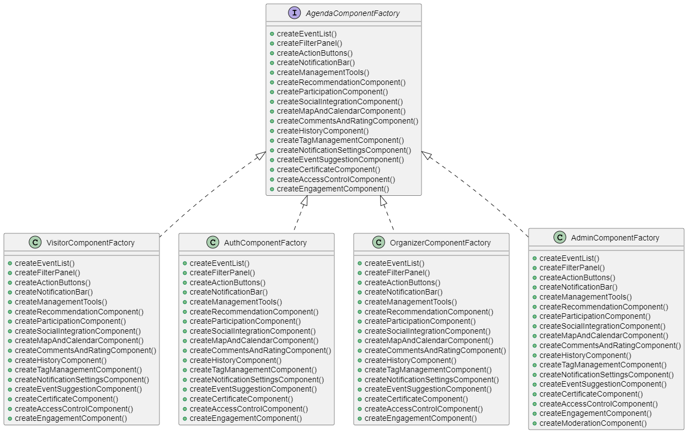
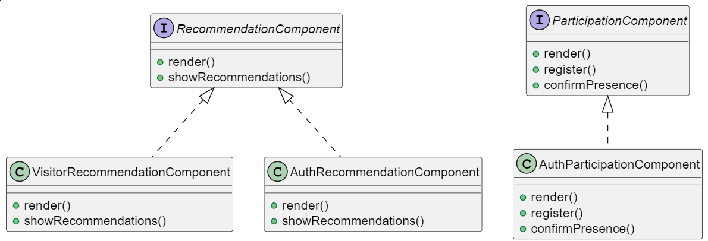
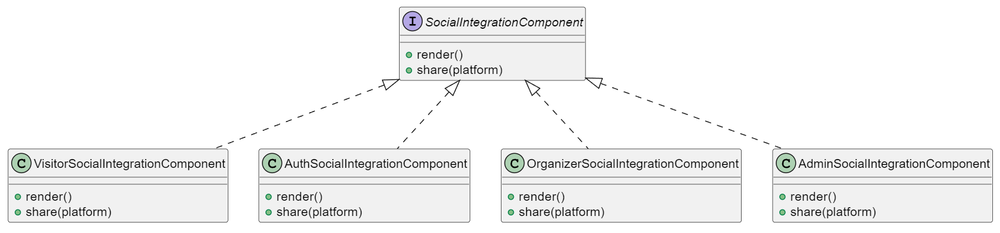
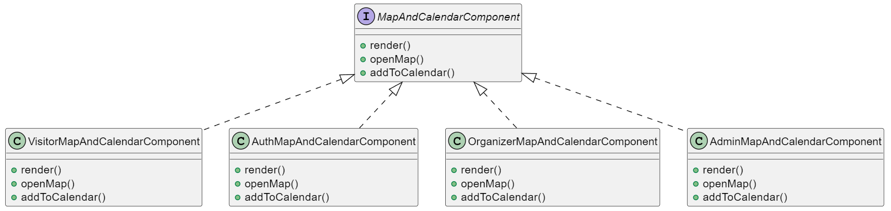
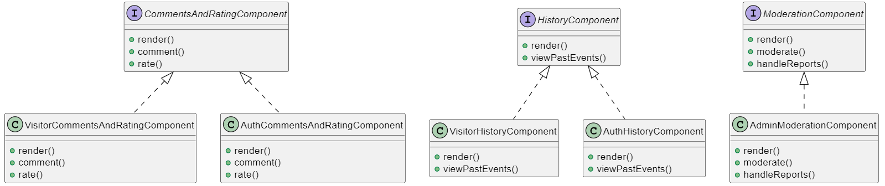
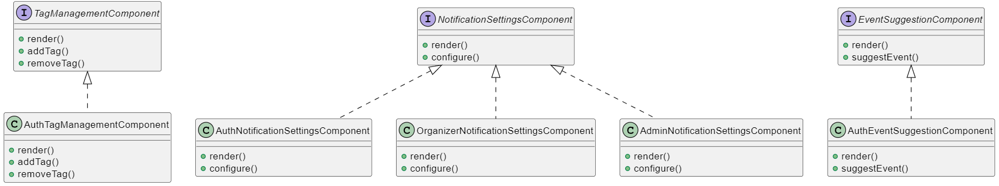
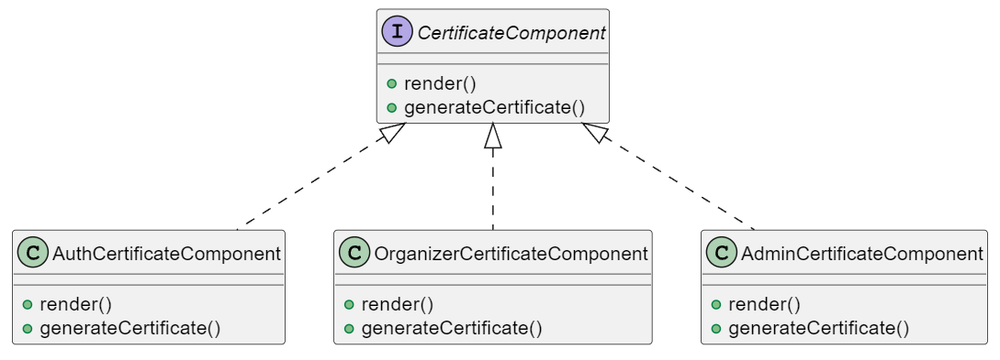
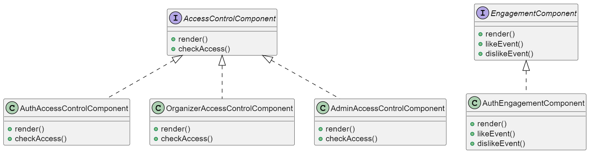

# Abstract Factory

Este documento apresenta um diagrama de classes UML, gerado com PlantUML, que ilustra o padrão de projeto Abstract Factory. Inspirado na definição clássica de [Gamma et al. (1995)](#ref1), o artefato demonstra como separar a criação de famílias de objetos por meio de interfaces abstratas e implementações concretas, promovendo alto grau de flexibilidade e baixo acoplamento no sistema ([Gamma et al., 1995](#ref1)).

Além disso, o uso do PlantUML agiliza a construção e manutenção do diagrama, permitindo alterações rápidas diretamente no código-fonte do PUML e visualização instantânea no VS Code ([PlantUML, 2025](#ref2)). Esse fluxo prático facilita tanto o entendimento do padrão quanto a documentação evolutiva do projeto.

## Metodologia

Para a construção deste artefato, iniciou-se por um levantamento bibliográfico sobre o padrão **Abstract Factory**, baseado na obra seminal de [Gamma et al. (1995)](#ref1), que descreve os fundamentos do padrão e suas motivações para a criação de famílias de objetos sem acoplamento direto às classes concretas ([GAMMA et al., 1995](#ref1)). Complementarmente, consultou-se a literatura sobre modelagem UML para orientar a tradução dos conceitos de padrão em elementos de diagrama de classes ([LARMAN, 2004](#ref3); [RUMBAUGH et al., 2004](#ref4)). A partir desse referencial, foram identificadas as “famílias” de componentes necessárias (listas de eventos, filtros, botões de ação etc.) e seus correspondentes papéis abstratos, de modo a definir claramente as interfaces de fábrica e de produto que sustentam o padrão.

Em seguida, procedeu-se à especificação do diagrama utilizando **PlantUML**, promovendo um fluxo ágil onde alterações no código fonte `.puml` são imediatamente refletidas na visualização do diagrama no VS Code ([PLANTUML, 2025](#ref2)). O arquivo foi estruturado em conformidade com a sintaxe declarativa da ferramenta, definindo a interface `AgendaComponentFactory` e suas implementações concretas, bem como as interfaces e classes de cada componente. Após geração inicial, o diagrama passou por duas rodadas de validação: (a) checagem de aderência ao padrão Abstract Factory, assegurando a separação entre abstração e implementação, e (b) revisão de nomenclatura e relacionamentos para garantir clareza e consistência semântica.

## Diagramas UML Gerados

Os diagramas gerados podem ser visualizados no arquivo [`abstractFactory.puml`](./PadroesDeProjeto/gofsCriacionais/AbstractFactory/abstractFactory.md), localizado no diretório `docs/PadroesDeProjeto/gofsCriacionais/AbstractFactory/` do repositório. 

Abaixo, apresentamos o diagrama UML gerado com base nesse arquivo. A modelagem foi construída a partir de todos os [requisitos funcionais](https://unbarqdsw2025-1-turma02.github.io/2025.1-T02-G4_AgendaFCTE_Entrega_02/#/./Modelagem/requisitos) definidos para o projeto.

  <figure id="fig1">
    
    <figcaption>Figura 1</figcaption>
  </figure>
  <figure id="fig2">
    
    <figcaption>Figura 2</figcaption>
  </figure>
  <figure id="fig3">
    
    <figcaption>Figura 3</figcaption>
  </figure>
  <figure id="fig4">
    
    <figcaption>Figura 4</figcaption>
  </figure>
  <figure id="fig5">
    
    <figcaption>Figura 5</figcaption>
  </figure>
  <figure id="fig6">
    
    <figcaption>Figura 6</figcaption>
  </figure>
  <figure id="fig7">
    
    <figcaption>Figura 7</figcaption>
  </figure>
  <figure id="fig8">
    
    <figcaption>Figura 8</figcaption>
  </figure>

## Referências Bibliográficas

> <a id='ref1' style="text-decoration: none; color: inherit;">GAMMA, Erich; HELM, Richard; JOHNSON, Ralph; VLISSIDES, John. *Design Patterns: Elements of Reusable Object-Oriented Software*. Boston: Addison-Wesley, 1995.</a>
>
> <a id='ref3' style="text-decoration: none; color: inherit;">LARMAN, Craig. *Applying UML and Patterns: An Introduction to Object-Oriented Analysis and Design and Iterative Development*. 3. ed. Boston: Prentice Hall, 2004.</a>
>
> <a id='ref4' style="text-decoration: none; color: inherit;">RUMBAUGH, James; JACOBSON, Ivar; BOOCH, Grady. *The Unified Modeling Language Reference Manual*. 2. ed. Boston: Addison-Wesley, 2004.</a>
>
> <a id='ref2' style="text-decoration: none; color: inherit;"> PLANTUML. *PlantUML*. Disponível em: [https://plantuml.com](https://plantuml.com). Acesso em: 22 maio 2025.</a>

## Histórico de Versão

| Versão | Data | Descrição | Autor | Revisor | Comentário do Revisor |
| -- | -- | -- | -- | -- | -- |
| `1.0`  | 19/05/2025 | Programando diversas classes no abstractFactory.puml | [Thales Euflauzino](https://github.com/thaleseuflauzino) | | |
| `1.1`  | 22/05/2025 | Justificando metodologia e uso do puml, e referenciando os materiais com as fontes utilizadas para elaboração| [Víctor Schmidt](https://github.com/moonshinerd) | | |
| `1.2`  | 22/05/2025 | Adicionando as imagens geradas no .puml | [Víctor Schmidt](https://github.com/moonshinerd) | | |