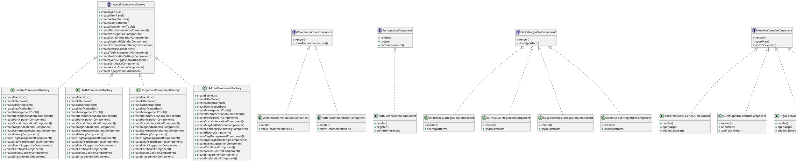

```plantuml
@startuml Abstract Factory

interface AgendaComponentFactory {
  +createEventList()
  +createFilterPanel()
  +createActionButtons()
  +createNotificationBar()
  +createManagementTools()
  +createRecommendationComponent()
  +createParticipationComponent()
  +createSocialIntegrationComponent()
  +createMapAndCalendarComponent()
  +createCommentsAndRatingComponent()
  +createHistoryComponent()
  +createTagManagementComponent()
  +createNotificationSettingsComponent()
  +createEventSuggestionComponent()
  +createCertificateComponent()
  +createAccessControlComponent()
  +createEngagementComponent()
}

class VisitorComponentFactory {
  +createEventList()
  +createFilterPanel()
  +createActionButtons()
  +createNotificationBar()
  +createManagementTools()
  +createRecommendationComponent()
  +createParticipationComponent()
  +createSocialIntegrationComponent()
  +createMapAndCalendarComponent()
  +createCommentsAndRatingComponent()
  +createHistoryComponent()
  +createTagManagementComponent()
  +createNotificationSettingsComponent()
  +createEventSuggestionComponent()
  +createCertificateComponent()
  +createAccessControlComponent()
  +createEngagementComponent()
}
class AuthComponentFactory {
  +createEventList()
  +createFilterPanel()
  +createActionButtons()
  +createNotificationBar()
  +createManagementTools()
  +createRecommendationComponent()
  +createParticipationComponent()
  +createSocialIntegrationComponent()
  +createMapAndCalendarComponent()
  +createCommentsAndRatingComponent()
  +createHistoryComponent()
  +createTagManagementComponent()
  +createNotificationSettingsComponent()
  +createEventSuggestionComponent()
  +createCertificateComponent()
  +createAccessControlComponent()
  +createEngagementComponent()
}
class OrganizerComponentFactory {
  +createEventList()
  +createFilterPanel()
  +createActionButtons()
  +createNotificationBar()
  +createManagementTools()
  +createRecommendationComponent()
  +createParticipationComponent()
  +createSocialIntegrationComponent()
  +createMapAndCalendarComponent()
  +createCommentsAndRatingComponent()
  +createHistoryComponent()
  +createTagManagementComponent()
  +createNotificationSettingsComponent()
  +createEventSuggestionComponent()
  +createCertificateComponent()
  +createAccessControlComponent()
  +createEngagementComponent()
}
class AdminComponentFactory {
  +createEventList()
  +createFilterPanel()
  +createActionButtons()
  +createNotificationBar()
  +createManagementTools()
  +createRecommendationComponent()
  +createParticipationComponent()
  +createSocialIntegrationComponent()
  +createMapAndCalendarComponent()
  +createCommentsAndRatingComponent()
  +createHistoryComponent()
  +createTagManagementComponent()
  +createNotificationSettingsComponent()
  +createEventSuggestionComponent()
  +createCertificateComponent()
  +createAccessControlComponent()
  +createEngagementComponent()
  +createModerationComponent()
}

AgendaComponentFactory <|.. VisitorComponentFactory
AgendaComponentFactory <|.. AuthComponentFactory
AgendaComponentFactory <|.. OrganizerComponentFactory
AgendaComponentFactory <|.. AdminComponentFactory

interface RecommendationComponent {
  +render()
  +showRecommendations()
}
interface ParticipationComponent {
  +render()
  +register()
  +confirmPresence()
}
interface SocialIntegrationComponent {
  +render()
  +share(platform)
}
interface MapAndCalendarComponent {
  +render()
  +openMap()
  +addToCalendar()
}
interface CommentsAndRatingComponent {
  +render()
  +comment()
  +rate()
}
interface HistoryComponent {
  +render()
  +viewPastEvents()
}
interface ModerationComponent {
  +render()
  +moderate()
  +handleReports()
}
interface TagManagementComponent {
  +render()
  +addTag()
  +removeTag()
}
interface NotificationSettingsComponent {
  +render()
  +configure()
}
interface EventSuggestionComponent {
  +render()
  +suggestEvent()
}
interface CertificateComponent {
  +render()
  +generateCertificate()
}
interface AccessControlComponent {
  +render()
  +checkAccess()
}
interface EngagementComponent {
  +render()
  +likeEvent()
  +dislikeEvent()
}

class VisitorRecommendationComponent {
  +render()
  +showRecommendations()
}
class AuthRecommendationComponent {
  +render()
  +showRecommendations()
}
' class OrganizerRecommendationComponent {
'   +render()
'   +showRecommendations()
' }

' Organizador ve recomendacoes?

' class AdminRecommendationComponent {
'   +render()
'   +showRecommendations()
' } 
'
' Admin ve recomendacoes?

RecommendationComponent <|.. VisitorRecommendationComponent
RecommendationComponent <|.. AuthRecommendationComponent
' RecommendationComponent <|.. OrganizerRecommendationComponent
' RecommendationComponent <|.. AdminRecommendationComponent

' class VisitorParticipationComponent {
'   +render()
'   +register()
'   +confirmPresence()
' }
class AuthParticipationComponent {
  +render()
  +register()
  +confirmPresence()
}
' class OrganizerParticipationComponent {
'   +render()
'   +register()
'   +confirmPresence()
' }
' class AdminParticipationComponent {
'   +render()
'   +register()
'   +confirmPresence()
' }

' Visitor, Organizer e Admin confirmam/ve participacao?

' ParticipationComponent <|.. VisitorParticipationComponent
ParticipationComponent <|.. AuthParticipationComponent
' ParticipationComponent <|.. OrganizerParticipationComponent
' ParticipationComponent <|.. AdminParticipationComponent

class VisitorSocialIntegrationComponent {
  +render()
  +share(platform)
}
class AuthSocialIntegrationComponent {
  +render()
  +share(platform)
}
class OrganizerSocialIntegrationComponent {
  +render()
  +share(platform)
}
class AdminSocialIntegrationComponent {
  +render()
  +share(platform)
}
SocialIntegrationComponent <|.. VisitorSocialIntegrationComponent
SocialIntegrationComponent <|.. AuthSocialIntegrationComponent
SocialIntegrationComponent <|.. OrganizerSocialIntegrationComponent
SocialIntegrationComponent <|.. AdminSocialIntegrationComponent

class VisitorMapAndCalendarComponent {
  +render()
  +openMap()
  +addToCalendar()
}
class AuthMapAndCalendarComponent {
  +render()
  +openMap()
  +addToCalendar()
}
class OrganizerMapAndCalendarComponent {
  +render()
  +openMap()
  +addToCalendar()
}
class AdminMapAndCalendarComponent {
  +render()
  +openMap()
  +addToCalendar()
}
MapAndCalendarComponent <|.. VisitorMapAndCalendarComponent
MapAndCalendarComponent <|.. AuthMapAndCalendarComponent
MapAndCalendarComponent <|.. OrganizerMapAndCalendarComponent
MapAndCalendarComponent <|.. AdminMapAndCalendarComponent

class VisitorCommentsAndRatingComponent {
  +render()
  +comment()
  +rate()
}
class AuthCommentsAndRatingComponent {
  +render()
  +comment()
  +rate()
}
' class OrganizerCommentsAndRatingComponent {
'   +render()
'   +comment()
'   +rate()
' }
' class AdminCommentsAndRatingComponent {
'   +render()
'   +comment()
'   +rate()
' }

' Visitor e Auth comentam e avaliam?

CommentsAndRatingComponent <|.. VisitorCommentsAndRatingComponent
CommentsAndRatingComponent <|.. AuthCommentsAndRatingComponent
' CommentsAndRatingComponent <|.. OrganizerCommentsAndRatingComponent
' CommentsAndRatingComponent <|.. AdminCommentsAndRatingComponent

class VisitorHistoryComponent {
  +render()
  +viewPastEvents()
}
class AuthHistoryComponent {
  +render()
  +viewPastEvents()
}
' class OrganizerHistoryComponent {
'   +render()
'   +viewPastEvents()
' }
' class AdminHistoryComponent {
'   +render()
'   +viewPastEvents()
' }

' Visitor e Auth veem eventos passados?

HistoryComponent <|.. VisitorHistoryComponent
HistoryComponent <|.. AuthHistoryComponent
' HistoryComponent <|.. OrganizerHistoryComponent
' HistoryComponent <|.. AdminHistoryComponent

class AdminModerationComponent {
  +render()
  +moderate()
  +handleReports()
}
ModerationComponent <|.. AdminModerationComponent

class AuthTagManagementComponent {
  +render()
  +addTag()
  +removeTag()
}
TagManagementComponent <|.. AuthTagManagementComponent

class AuthNotificationSettingsComponent {
  +render()
  +configure()
}
class OrganizerNotificationSettingsComponent {
  +render()
  +configure()
}
class AdminNotificationSettingsComponent {
  +render()
  +configure()
}

NotificationSettingsComponent <|.. AuthNotificationSettingsComponent
NotificationSettingsComponent <|.. OrganizerNotificationSettingsComponent
NotificationSettingsComponent <|.. AdminNotificationSettingsComponent

class AuthEventSuggestionComponent {
  +render()
  +suggestEvent()
}
EventSuggestionComponent <|.. AuthEventSuggestionComponent

class AuthCertificateComponent {
  +render()
  +generateCertificate()
}
class OrganizerCertificateComponent {
  +render()
  +generateCertificate()
}
class AdminCertificateComponent {
  +render()
  +generateCertificate()
}
CertificateComponent <|.. AuthCertificateComponent
CertificateComponent <|.. OrganizerCertificateComponent
CertificateComponent <|.. AdminCertificateComponent

class AuthAccessControlComponent {
  +render()
  +checkAccess()
}
class OrganizerAccessControlComponent {
  +render()
  +checkAccess()
}
class AdminAccessControlComponent {
  +render()
  +checkAccess()
}
AccessControlComponent <|.. AuthAccessControlComponent
AccessControlComponent <|.. OrganizerAccessControlComponent
AccessControlComponent <|.. AdminAccessControlComponent

class AuthEngagementComponent {
  +render()
  +likeEvent()
  +dislikeEvent()
}
EngagementComponent <|.. AuthEngagementComponent

@enduml

```
