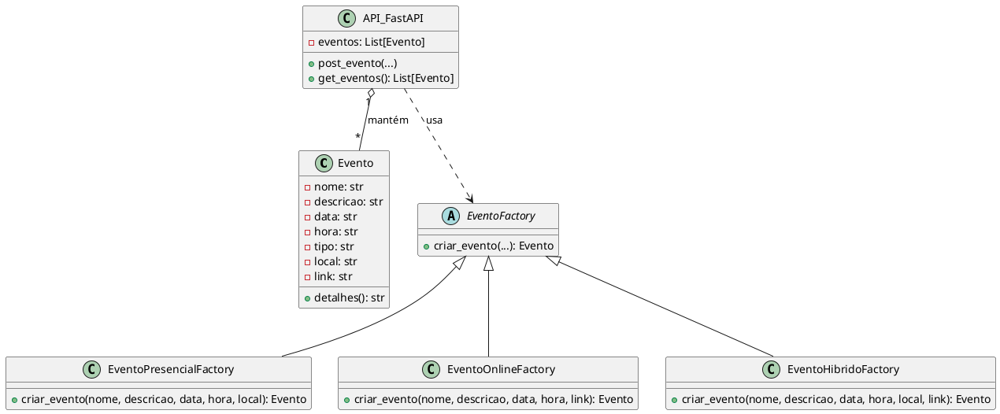

```plantuml
@startuml Factory Method

class Evento {
  - nome: str
  - descricao: str
  - data: str
  - hora: str
  - tipo: str
  - local: str
  - link: str
  + detalhes(): str
}

abstract class EventoFactory {
  + criar_evento(...): Evento
}

class EventoPresencialFactory {
  + criar_evento(nome, descricao, data, hora, local): Evento
}

class EventoOnlineFactory {
  + criar_evento(nome, descricao, data, hora, link): Evento
}

class EventoHibridoFactory {
  + criar_evento(nome, descricao, data, hora, local, link): Evento
}

class API_FastAPI {
  - eventos: List[Evento]
  + post_evento(...)
  + get_eventos(): List[Evento]
}

EventoFactory <|-- EventoPresencialFactory
EventoFactory <|-- EventoOnlineFactory
EventoFactory <|-- EventoHibridoFactory
API_FastAPI ..> EventoFactory : usa
API_FastAPI "1" o-- "*" Evento : mantém

@enduml

```