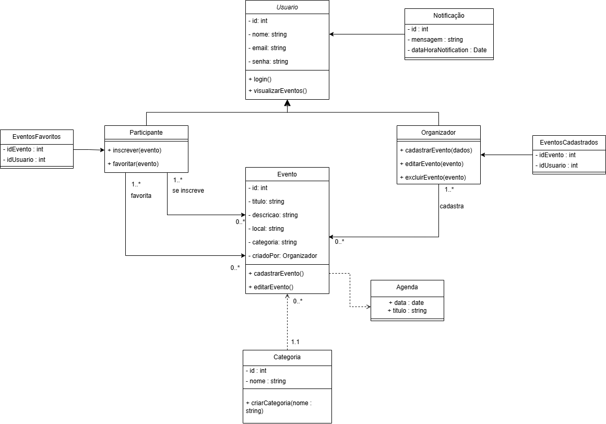

# Prototype
## Introdução

Ao criar um diagrama de classes, uma questão importante que pode gerar gargalos de desempenho é identificar de quem é a responsabilidade pela instanciação de uma classe, ou mesmo transferir essa responsabilidade. Alguns padrões de design criacionais do GoF (Gang of Four) ajudam a lidar com essa questão, focando em como os objetos são criados e auxiliando na implementação de um sistema mais flexível e reutilizável, evitando dependências rígidas. São eles:

1. Singleton: Garante que uma classe tenha apenas uma instância e fornece um ponto de acesso global a essa instância. Ou seja, garante que quando você criar um objeto só que depois de um tempo você precisa desse objeto de novo, você obtêm o que já tinha sido criado em vez de instanciar criar um novo. Esse padrão de projeto não faz sentido para o projeto já que não existe nenhum classe declarada no diagrama ou recurso que não possa ser sobrescrito.

2. Prototype: Permite criar novos objetos a partir da cópia de um objeto existente, conhecido como protótipo. Esse padrão é útil quando a criação de um objeto envolve um custo alto de configuração ou quando se deseja gerar múltiplas versões de um objeto com pequenas variações. Em vez de instanciar manualmente um novo objeto e configurar tudo de novo, utiliza-se o método clone() para copiar um objeto já existente e, se necessário, fazer alterações pontuais.

<a id="fig2">**Figura 1 – Diagrama de Classes**</a>

<b>_Autor: <a href="https://github.com/AlexandreLjr">Alexandre Junior</a>_</b>

<a id="fig2">**Figura 2 – Implementação Prototype Typescript (Eventos)**</a>

<b>_Autor: <a href="https://github.com/maykonjuso">Maykon Soares</a>_</b>

## Referências Bibliográficas

> [<a id='ref1'>1</a>] REFACTORING GURU. _Singleton_. s.l., s.d. Disponível em: <https://refactoring.guru/pt-br/design-patterns/singleton>. Acesso em: 19 mai. 2025.

## Histórico de Versões

| Versão | Data       | Descrição                                                      | Autor                                            | Revisor | Comentário do Revisor |
| ------ | ---------- | -------------------------------------------------------------- | ------------------------------------------------ | ------- | --------------------- |
| `1.1`  | 19/05/2025 | Adição do texto sobre Singleton e sua referência bibliográfica | [Victório Lázaro](https://github.com/Victor-oss) |         |                       |
| `1.2`  | 20/05/2025 | Adição do texto sobre Singleton e sua referência bibliográfica | [Maykon Soares](https://github.com/maykonjuso)   |         |                       |
| `1.3`  | 22/05/2025 | Reestruturando a documentação | [Víctor Schmidt](https://github.com/moonshinerd)   |         |                       |