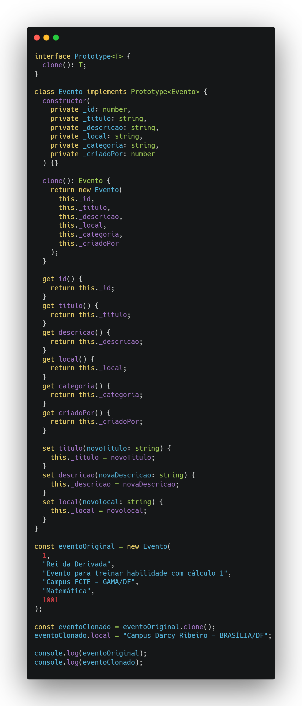

# Prototype

Quando projetamos o diagrama de classes, definir quem cria cada objeto é crucial para evitar acoplamentos excessivos e gargalos de desempenho. O padrão **Prototype** do GoF oferece uma solução elegante: em vez de instanciar um objeto do zero sempre que necessário, reutiliza-se um “protótipo” já inicializado e, por meio de um método `clone()`, gera-se cópias idênticas ou quase idênticas. Isso é particularmente vantajoso quando:

- A configuração inicial do objeto envolve múltiplas etapas (leitura de arquivos, conexões a serviços externos, cálculos complexos), tornando sua criação “pesada”.
- Há a necessidade de produzir várias instâncias semelhantes, mas com pequenas diferenças (como estilos de interface, parâmetros de simulação ou valores padrão).

Ao clonar, podemos escolher entre cópias superficiais (shallow copy) ou profundas (deep copy), dependendo de quão isolados devem ser os objetos resultantes. É importante adicionar que o Prototype também é bem útil em cenários onde o sistema precisa preservar o estado interno de objetos em um determinado momento, como em mecanismos de undo/redo, já que o clone pode servir como um snapshot imutável do objeto original.  No diagrama, geralmente identifica-se uma interface `Prototype` com o método `clone()`, e cada classe concreta implementa sua própria lógica de cópia. Assim, a responsabilidade pela criação fica dentro do próprio protótipo, conferindo flexibilidade, reduzindo dependências rígidas e agilizando a extensão do sistema.

<a id="fig2">**Figura 1 – Diagrama de Classes**</a>

<b>_Autor: <a href="https://github.com/AlexandreLjr">Alexandre Junior</a>_</b>

<a id="fig2">**Figura 2 – Implementação Prototype Typescript (Eventos)**</a>

<b>_Autor: <a href="https://github.com/maykonjuso">Maykon Soares</a>_</b>

## Referências Bibliográficas

> [<a id='ref1'>1</a>] REFACTORING GURU. _Singleton_. s.l., s.d. Disponível em: <https://refactoring.guru/pt-br/design-patterns/singleton>. Acesso em: 19 mai. 2025.

## Histórico de Versões

| Versão | Data | Descrição | Autor | Revisor | Comentário do Revisor |
| -- | -- | -- | -- | -- | -- |
| `1.0`  | 20/05/2025 | Realizando e estruturando o documento | [Maykon Soares](https://github.com/maykonjuso) | [Victório Lázaro](https://github.com/Victor-oss) | Revisado          |
| `1.1`  | 22/05/2025 | Reestruturando a documentação | [Víctor Schmidt](https://github.com/moonshinerd) | [Victório Lázaro](https://github.com/Victor-oss)  | Revisado |
| `1.2`  | 25/05/2025 | Corrigindo requests feitos pelo revisor na documentaçao | [Víctor Schmidt](https://github.com/moonshinerd) | [Victório Lázaro](https://github.com/Victor-oss)  | Revisado |
