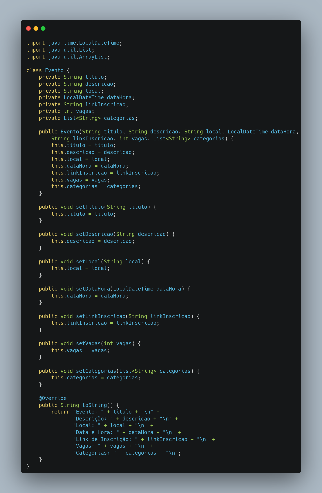
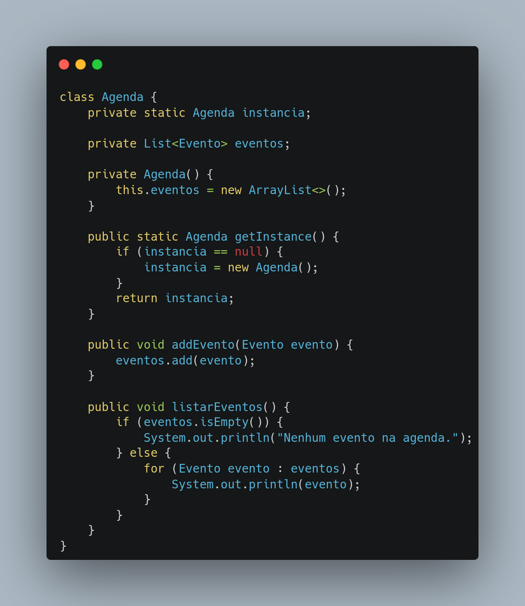

# Singleton
O padrão de projeto Singleton garante que uma classe tenha apenas uma instância e forneça um ponto de acesso global a essa instância. Ou seja, garante que quando você criar um objeto e precisar dele novamene um tempo depois, você obtêm o objeto que já tinha sido criado em vez de instanciar um novo. Uma outra definição para o Singleton é que ele é a forma encontrada para usar variáveis globais dentro da Orientação a Objetos.

Esse padrão de projeto não faz sentido para o projeto já que não existe nenhum classe declarada no diagrama ou recurso cuja instanciação não possa ser sobrescrita. Portanto, para fins puramente didáticos, vamos criar um Singleton a partir da classe Agenda, que é uma classe só conceitual para representar o conjunto de eventos.

<center>

<a id="fig1">**Figura 1 – Diagrama de Classes**</a>


<font size="2"><p style="text-align: center"><b>_Autor: <a href="https://github.com/AlexandreLjr">Alexandre Junior</a>_</b></p></font>

</center>

```plaintext
+--------------------+
|  Agenda            |
+--------------------+
| - instancia:       |
|   Agenda           |
| - eventos:         |
| List<Evento>       |
+--------------------+
| + get_instance()   |
| + add_evento()     |
| + listar_eventos() |
+--------------------+
```

## Código Singleton

A implementação da classe declarada em código Java está disponível nas imagens abaixo

<center>

<a id="fig2">**Figura 2 – Implementação da classe Evento em Java**</a>



<font size="2"><p style="text-align: center"><b>_Autor: <a href="https://github.com/Victor-oss">Victório Lázaro</a>_</b></p></font>

<a id="fig3">**Figura 3 – Implementação da classe Singleton Agenda em Java**</a>



<font size="2"><p style="text-align: center"><b>_Autor: <a href="https://github.com/Victor-oss">Victório Lázaro</a>_</b></p></font>

</center>


## Referências Bibliográficas

> [<a id='ref1'>1</a>] REFACTORING GURU. _Singleton_. s.l., s.d. Disponível em: <https://refactoring.guru/pt-br/design-patterns/singleton>. Acesso em: 19 mai. 2025.

## Histórico de Versões

| Versão | Data       | Descrição                                                      | Autor                                            | Revisor | Comentário do Revisor |
| ------ | ---------- | -------------------------------------------------------------- | ------------------------------------------------ | ------- | --------------------- |
| `1.1`  | 19/05/2025 | Adição do texto sobre Singleton e sua referência bibliográfica | [Victório Lázaro](https://github.com/Victor-oss) |         |                       |
| `1.2`  | 24/05/2025 | Adição do código Singleton de exemplo  | [Victório Lázaro](https://github.com/Victor-oss)   |         |                       |