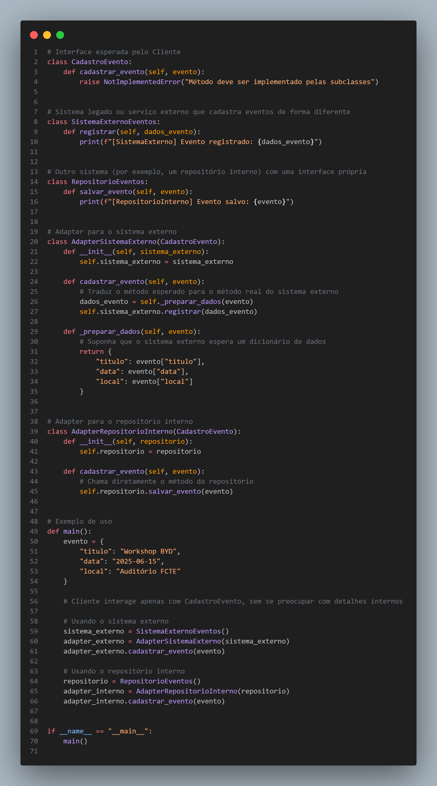

# Adapter

## Introdução

O **Adapter** é um padrão de projeto estrutural que tem como principal objetivo permitir que classes com interfaces incompatíveis trabalhem juntas. Ele age como um intermediário que converte a interface de um objeto para outra interface que o cliente espera, funcionando como um “adaptador” de comunicação.

Esse padrão é muito útil em situações onde é necessário integrar sistemas ou componentes desenvolvidos separadamente e que não se encaixam diretamente.

<!-- ## Como o Adapter Funciona

No Adapter, temos um cenário com classes que já existem (as que precisam ser adaptadas) e uma interface que o sistema ou o cliente espera encontrar. Para conectar esses dois lados, criamos uma camada intermediária — o Adapter — que traduz as chamadas e permite que as classes trabalhem juntas sem que seja necessário alterar o código original.

De maneira geral, o Adapter converte as chamadas de um lado (o cliente) para algo que o outro lado (o componente adaptado) entende, e vice-versa. -->

## Elementos do Adapter

O padrão é formado pelos seguintes elementos principais:

- **Cliente (Client)**: O componente que precisa usar um serviço ou funcionalidade, mas que espera uma interface específica.

- **Alvo (Target)**: A interface que o cliente está esperando para interagir.

- **Adaptador (Adapter)**: A classe que implementa a interface esperada (Target) e traduz as chamadas para a interface real do sistema existente.

- **Adaptado (Adaptee)**: O componente que tem uma interface diferente da que o cliente espera. Ele fornece a funcionalidade que queremos reutilizar, mas de forma incompatível.

## Vantagens do Adapter

 **Integração sem alterações**: É possível utilizar classes e sistemas que já existem, sem precisar mexer no código original.  
 **Flexibilidade**: Caso novos formatos ou componentes precisem ser integrados no futuro, basta criar novos Adapters.  
 **Manutenção facilitada**: O Adapter centraliza a adaptação, deixando o resto do sistema mais limpo e organizado.  
 **Redução de acoplamento**: O cliente só se importa com a interface esperada, sem depender diretamente das classes reais.

## Metodologia

É muito comum em aplicativos de Agendas Culturais a necessidade de permitir diferentes formas de login, como autenticação por e-mail, Google ou até outras opções no futuro. Cada uma dessas formas de login tem um jeito próprio de lidar com a autenticação e fornece métodos diferentes, que não são compatíveis diretamente com o restante do sistema. Por isso escolhemos usar o Adapter para essa funcionalidade no Agenda Cultural FCTE.

Para resolver essa incompatibilidade sem alterar a arquitetura principal, optamos por adotar o padrão de projeto Adapter. Com ele, conseguimos criar uma camada intermediária que traduz as chamadas do cliente (a interface de login esperada pela aplicação) para os métodos reais de cada serviço de autenticação.

## Diagrama

## Implementação
Implementação em pyhton com o adapter sendo utilizado para a funcionalidade de cadastrar evento.

<!-- ## Conclusão

O padrão Adapter é essencial para tornar sistemas mais compatíveis e reaproveitar códigos já existentes, criando uma ponte entre diferentes interfaces. Ele reduz esforços de reescrita, promove a modularidade e garante que seu sistema continue crescendo de forma estruturada. -->

## Bibliografia

> REFACTORING GURU. Bridge – Padrões de Projeto. Disponível em: https://refactoring.guru/pt-br/design-patterns/adapter. Acesso em: 22 maio 2025.
>
> SERRANO, Milene. Padrões de Projeto GoF: Padrões Estruturais. Material didático disponibilizado no ambiente virtual Aprender3 da Universidade de Brasília, 2025.
>
> SERRANO, Milene. Padrões de Projeto GoF: Padrões Estruturais – Parte 2. Material didático disponibilizado no ambiente virtual Aprender3 da Universidade de Brasília, 2025.

##  Histórico de Versões

| Versão | Data       | Descrição                                    | Autor                                  | Revisor | Comentário do Revisor |
|--------|------------|----------------------------------------------|----------------------------------------|---------|------------------------|
| `1.0`    | 26/05/2025 | Elaboração dos textos do artefato | [Pedro Lopes](https://github.com/pLopess) | | |
| `1.1`    | 30/05/2025 | Adicionando código de implementação | [Pedro Lopes](https://github.com/pLopess) | | |