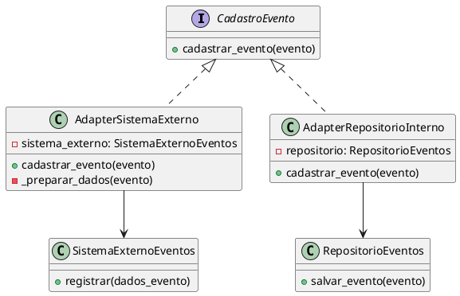

```puml
@startuml Padrão Adapter - Cadastro de Evento

' Interface Target
interface CadastroEvento {
    + cadastrar_evento(evento)
}

' Adaptee - Sistema externo
class SistemaExternoEventos {
    + registrar(dados_evento)
}

' Adaptee - Repositório interno
class RepositorioEventos {
    + salvar_evento(evento)
}

' Adapter para o Sistema Externo
class AdapterSistemaExterno {
    - sistema_externo: SistemaExternoEventos
    + cadastrar_evento(evento)
    - _preparar_dados(evento)
}

' Adapter para o Repositório Interno
class AdapterRepositorioInterno {
    - repositorio: RepositorioEventos
    + cadastrar_evento(evento)
}

' Relações
CadastroEvento <|.. AdapterSistemaExterno
CadastroEvento <|.. AdapterRepositorioInterno

AdapterSistemaExterno --> SistemaExternoEventos
AdapterRepositorioInterno --> RepositorioEventos

@enduml

```