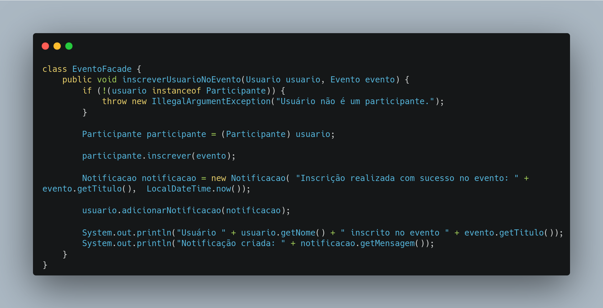

# Facade

## Código Facade

A implementação do Facade em código Java está disponível nas imagens abaixo

<center>

<a id="fig2">**Figura 1 – Implementação das classes Usuario, Participante, Evento e Notificacao em Java**</a>


<font size="2"><p style="text-align: center"><b>_Autor: <a href="https://github.com/Victor-oss">Victório Lázaro</a>_</b></p></font>

<a id="fig2">**Figura 2 – Implementação da classe EventoFacade em Java**</a>



<font size="2"><p style="text-align: center"><b>_Autor: <a href="https://github.com/Victor-oss">Victório Lázaro</a>_</b></p></font>


<font size="2"><p style="text-align: center"><b>Autor: <a href="https://github.com/Victor-oss">Victório Lázaro</a> </b></p></font>

</center>


## Como rodar

O código cria 1 objeto Facade e faz a inscrição de um usuário em um evento (processo que envolve várias classes). Para rodar, basta dar os comandos abaixo na raiz do projeto

```
cd docs/assets/Facade/codigo
javac Main.java
java Main
```

## Histórico de Versões

| Versão | Data       | Descrição                                                      | Autor                                            | Revisor | Comentário do Revisor |
| ------ | ---------- | -------------------------------------------------------------- | ------------------------------------------------ | ------- | --------------------- |
| `1.1`  | 27/05/2025 | Adição do código executável do Facade | [Victório Lázaro](https://github.com/Victor-oss) |         |        