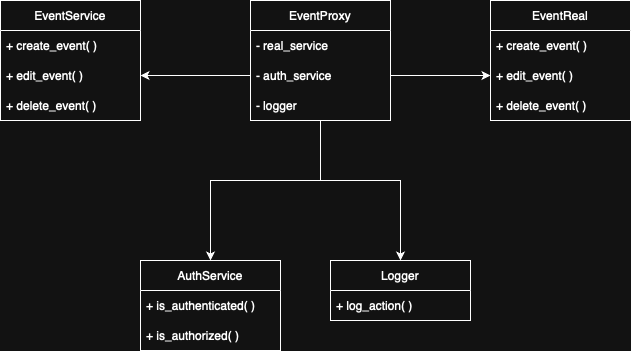
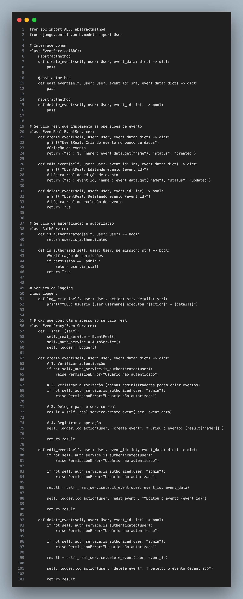

# Proxy
O padrão de projeto Proxy pertence ao grupo dos padrões estruturais e tem como principal objetivo fornecer um substituto ou representante de outro objeto para controlar o acesso a ele. Esse padrão é muito útil quando se deseja adicionar uma camada de controle, como verificação de permissões, carregamento sob demanda, controle de acesso remoto ou otimização de recursos. Na prática, o Proxy age como uma interface que se comunica com o objeto real, podendo decidir quando e como esse objeto será instanciado ou utilizado.

No contexto da linguagem Python, o padrão Proxy é implementado através da criação de uma classe que encapsula o objeto real, mantendo a mesma interface. Dessa forma, o Proxy intercepta as chamadas ao objeto, podendo adicionar comportamentos extras antes ou depois de delegar a execução para o objeto real, como autenticação, cache ou logging. Esse padrão é bastante aplicado em sistemas que precisam controlar o acesso a recursos pesados, serviços externos ou operações sensíveis.

## Aplicação 
No AgendaFCTE, o Proxy será aplicado para controlar o acesso às operações de criação, edição e exclusão de eventos. A API REST do Django terá rotas para essas operações, e o Proxy interceptará essas requisições para:

1.  **Verificar a autenticação do usuário:** Garantir que o usuário está logado.
2.  **Verificar a autorização do usuário:** Garantir que o usuário possui as permissões necessárias para a operação (ex: apenas administradores podem criar/editar/excluir eventos).
3.  **Realizar logging da operação:** Registrar quem realizou qual operação e quando.

## Modelagem

    
    

        <strong>Figura 1:</strong> Proxy - Modelagem UML 
        Autora: <a href="https://github.com/rayenealmeida" target="_blank" rel="noopener noreferrer">Rayene Almeida</a>
    

## Implementação 

    
    

        <strong>Figura 2:</strong> Proxy - Implementação das operações de evento 
        Autora: <a href="https://github.com/rayenealmeida" target="_blank" rel="noopener noreferrer">Rayene Almeida</a>
    

## Referências Bibliográficas

[<a id='ref1'>1</a>] GOF ESTRUTURAL - PROXY. Proxy Design Pattern. Disponível em: https://sourcemaking.com/design_patterns/proxy. Acesso em: 26 mai. 2025.

[<a id='ref2'>2</a>] GOF ESTRUTURAL - PROXY. Proxy Design Pattern in Python. Disponível em: https://sourcemaking.com/design_patterns/proxy/python/1. Acesso em: 26 mai. 2025.

[<a id='ref3'>3</a>] SERRANO, Milene. Arquitetura e Desenho de Software - Aula GoFs Estruturais. Universidade de Brasília - FGA. Disponível em: https://aprender3.unb.br/pluginfile.php/3070947/mod_page/content/1/Arquitetura%20e%20Desenho%20de%20Software%20-%20Aula%20GoFs%20Estruturais%20-%20Profa.%20Milene.pdf. Acesso em: 28 mai. 2025.

## Histórico de Versões

| Versão | Data       | Descrição                                                      | Autor                                            | Revisor | Comentário do Revisor |
|--------|------------|----------------------------------------------------------------|--------------------------------------------------|---------|-----------------------|
| 1.1  | 26/05/2025 | Adição do texto sobre Proxy e sua referência bibliográfica     | [Rayene Almeida](https://github.com/rayenealmeida) |         |                       |
| 1.2  | 28/05/2025 | Adição de aplicações 1, 2 e 3, implementação do código e modelagem das operações padrão de evento  | [Rayene Almeida](https://github.com/rayenealmeida) |     [João Lucas](https://github.com/joãolucas102)   |      Muito bem escrito, excelente.                 |
| 1.2.1  | 29/05/2025 | Adição do código proxi a estrutura de assets  | [João Lucas](https://github.com/joãolucas102) |
