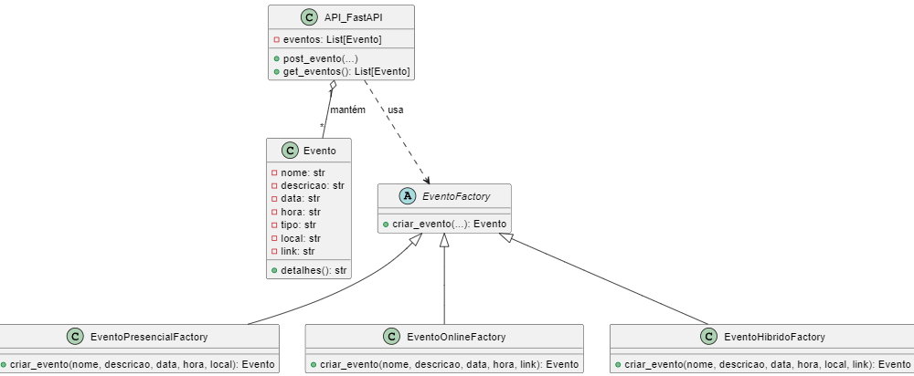
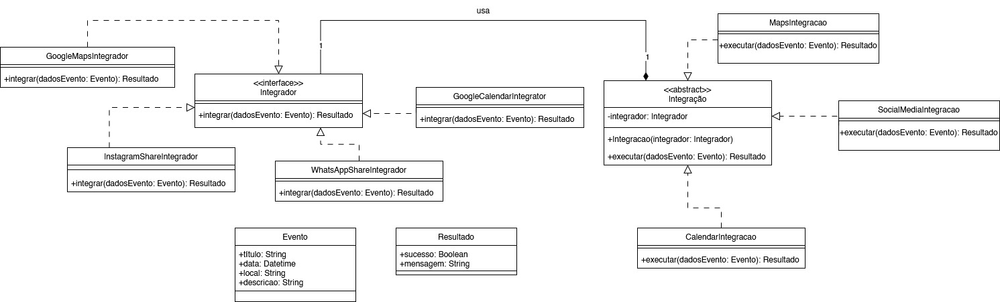
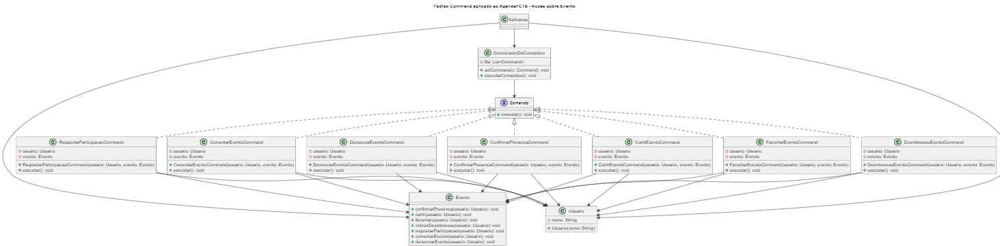

# AgendaFCTE

**Código da Disciplina**: FGA0208 
**Número do Grupo**: 04 
**Entrega**: 03 

## Alunos

|Matrícula | Aluno | Foto|
| -- | -- | -- |
| 20/2015868     | Alexandre Lema Xavier                  | 
 |
| 17/0146243     | João Lucas Costa Vale                  | 
 |
| 22/2015186     | Manoela Silvestre Garcia               | 
 |
| 21/1030863     | Maykon Júnio dos Santos Soares         | 
 |
| 21/1039671     | Pedro Lopes da Cunha                   | 
 |
| 22/1022720     | Rayene Ferreira Almeida                | 
 |
| 22/2006178     | Thales Henrique Euflauzino dos Santos  | 
 |
| 22/2029243     | Victor Hugo dos Santos Bernardes       | 
 |
| 22/2021924     | Víctor Hugo Lima Schmidt               | 
 |
| 21/1031860     | Victório Lázaro Rocha de Morais        | 
 |

## Sobre 
O AgendaFCTE é um web‑app que centraliza todos os eventos da FCTE em um só lugar, exibindo data, hora, local, descrição, link de inscrição e contato. Usuários autenticados (por e‑mail) podem filtrar a lista por tema, localização ou palavra‑chave, favoritar eventos, cadastrar novos eventos e gerenciar inscrições com controle de vagas, além de entrar em contato direto com os organizadores.

## Screenshots da Terceira Entrega

### Diagrama Factory Method

### Diagrama Bridge

### Diagrama Command

#### Histórico de Versões

| Versão | Data | Descrição | Autor | Revisor | Comentário do Revisor |
| -- | -- | -- | -- | -- | -- |
| `1.0` | 13/05/2025 | Criação do documento | [Thales Euflauzino](https://github.com/thaleseuflauzino) | [Víctor Schmidt](https://github.com/moonshinerd) | Revisado! Tudo certo |
| `1.1` | 01/06/2025 | Adicionando prints da entrega | [Víctor Schmidt](https://github.com/moonshinerd) |  |  |